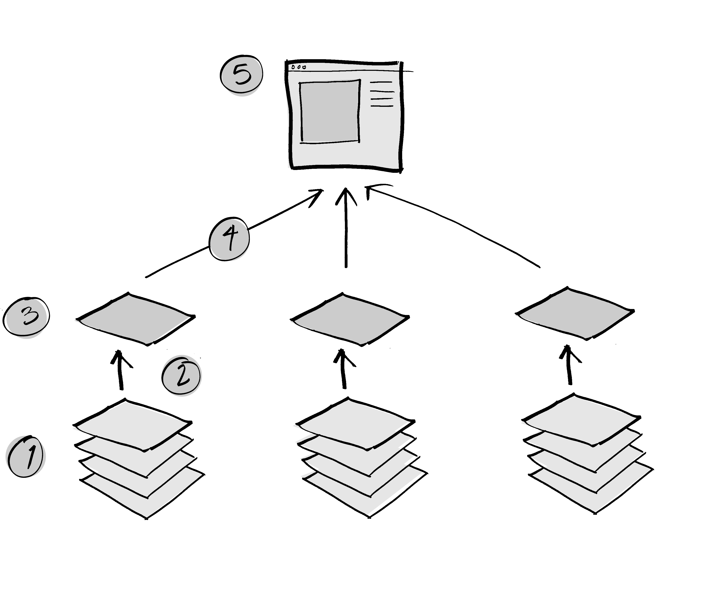

# Composable Image Set format specification

|    |    |
|----|----|
| Date    | 10 Dec 2019 |
| Version | 1.0 |
| Type    | COMPOSABLE_IMAGE_SET |
| Extension | `.cis` |
| Authors | David H. Rogers, John Patchet, Ethan Stam, Dave DeMarle, Sebastian Jourdain, Jonas Lucasczyk |

Cinema creates two types of image-based data that are useful within Cinema but also to a wider set of applications. The formats are discussed in <sup>[1]</sup>. The purpose of this specification is to standardize these data types and enable their use in other applications.

<table>
<tr>
<td></img></td>
<tr>
<td>Workflow for Cinema image set. Channels (1) are selected (2) to create layers (3), which are then composited into a final image (4) for viewing in some application (5).</td>
</tr>
</table>

This specification covers data needed to write out Cinema's `float images` and `composable images`. Per current Cinema specs:

1. `float images` contain float values for a single image. These are used to compute information about a variable from a rendered object, or to allow an image to be recolored with different color maps after it has been rendered. 
1. `composable images` contain several layers that can be composited to show a correct rendering from a specific camera position. These can also be recolored with different color maps. Using a set of these images, one can turn on and off different parts of a rendering, making the resulting image more interactive.

Often these images are useful to collect in sets, so this specification defines a format for collections of one or more such images.

## Requirements

- The specification shall provide capabilities for a **consumer** of the data to reconstruct a completely reproducable result. This data is not required, but the capabilty must exist within the specification.

## Flexible Information Encoding

This specification allows the **producer** of the image to encode a range of information, though there are no constraints on what a **consumer** of the image must do with it. The range of information goes from:

1. Minimal information. This is the minimal information needed to construct an image. All consumers of the images are expected to behave reasonably when minimal information is provided. 
2. Maximum information. This allows a consumer to (optionally) display the finished image in the exact state that the producer expects it to be in. This allows a direct comparison between the producer's image and the consumer's.

## Overview

A **composable image set** is a collection of one or more `images`. `Images` are sets of one or more `layers`. `Layers` are composed of one or more `channels`. `Channels` are composed of `values`.

An **image** is: a logical collection of data, formatted to be rendered into an `MxN` array of values intended to be transformed into a color image for display, printing, or in-memory computation. How the pixels are transformed and displayed is up to the consumer of this data, though the producer can provide information about expected results and constraints on this process. The image:

1. Has a know origin, which is one of four values: UL, UR, LL, LR. (upper left, upper right, lower left, lower right)
2. Has a specific 2D integer size (`MxN`)
3. Has one or more `layers`.

A **layer** is a logical collection of values used to construct a final `image`. A layer:

1. Is of known 2D integer size, less than or equal to the size of the `image`.
2. Is placed at a properly oriented [x,y] offset from the `image` origin. The offset values must be integers on the ranges `[0,M]` and `[0,N]`.
3. Must contain one or more channels. 
4. May contain an optional `lighting` channel. This contains information about the lighting at a value. A lighting channel can be of several types `[TYPE1, TYPE2, ...]`
5. May contain an optional `depth` channel. This contains information about the depth of a value in image space. Values are in the range `[0.0, 1.0]`, where `0.0` is the closest, and `1.0` is the farthest.
6. May contain an optional `mask` channel. This channel's values are by default boolean, but they may be any other valid type.

A **channel** is a set of values. A channel:

1. Is the dimension of the layer that contains it
2. May be of any valid type
 

# Storage

A `composable image set` may be stored in any of several formats.

## Cinema storage

(details of current cinema storage)

## HDF5 storage

The `composable image set` can be stored a single [HDF5](https://en.wikipedia.org/wiki/Hierarchical_Data_Format) file. We note the [existing specification](https://support.hdfgroup.org/HDF5/doc/ADGuide/ImageSpec.html) for images to be stored in HDF5 format. Where possible, this specification adopts conventions from that specification. 

If it is stored in HDF5 format, it shall have the following structure:

```
/
    class   (attribute, required) COMPOSABLE_IMAGE_SET 
    dims    (attribute, required) [int, int]
            This is the absolute size of the completed image
    flags   (attribute, optional)
            A list of flags, providing additional information about this data
            - IMAGES_INDEPENDENT images DO NOT have the same set of layers and channels. 
                                 Default, if this flag is not included, is that all images 
                                 have the same layers, and all layers have the same channels.
    origin  (attribute, optional) [UL, UR, LL, LR]
            The 0,0 point for the image. Default value is UL
    version (attribute, required) string
            The version of this specification that the data conforms with
    <name>  (attribute, optional) 
            Optional attributes may be added
    <type>/ (group, optional)
        <name> (attribute, optional)
            Named instace of a type of data 
    image/ (group, required)
        <name> (attribute, optional) 
               Optional attributes may be added
        <name>/ (one or more named groups, each of which is an image) (required)
            <name> (attribute, optional) 
                   Optional attributes may be added
            parameter/ (group, optional)
                    parameters that define this level of the hierarchy
            layer/ (group, required)
                <name> (attribute, optional) 
                       Optional attributes may be added
                <name>/ (one or more named groups, each of which is a layer) (required)
                    parameter/ (group, optional)
                                 parameters that define this level of the hierarchy
                    offset (attribute, optional) [int, int]
                           Offset of the layer's channels from "/origin". If not included, default
                           value is [0, 0], or no offset
                    dims   (attribute, optional) [int, int]
                           Dimensions of the layer. If not present, assumed to be "/dims"
                    <name> (attribute, optional) 
                           Optional attributes may be added
                    channel/
                        depth/  (dataset, optional)
                            type (attribute) (optional) [valid type string]
                                 If not present, values are assumed to be float
                        lighting/ (dataset, optional)
                            type (attribute, optional) [valid type string]
                                 If not present, values are assumed to be float
                        mask/   (dataset, optional)
                            type (attribute, optional) [valid type string]
                                 If not present, values are assumed to be boolean
                        <name>/ (one or more named datasets, required)
                            type (attribute, optional) [valid type string]
                                 If not present, values are assumed to be float
                            variable (attribute, optional)
                                 The variable that this channel references
```

## Example

Example python code included in this directory writes and reads a simple `composable image set` in HDF5 format.

1. run `./write` to create example files:
    - `composable.cis` contains several images with several layers that can be composed together, and recolored by several variables.  
1. run `./dump <filename>` to dump the example files
1. run `./render <filename>` to render the images (under development)


Requirements:

1. `h5py` module

## Cinema Database Reference Example

The `.cis` format is a way of encoding specific types of information. It is up to a **producer** and **consumer** of the data to determine the semantic meaning of the encoded data.

Providing semantic meaning in a Cinema database entails providing metadata about the image/layer/channel components, and referencing a path in the `.cis` file. This is exactly analogous to providing a path to disk, except that the `FILE` that the path maps to is a `.cis` file. 

[This proposal](composable.md) shows how this data should be encoded in a Cinema database.


## Open areas 

One question is how to represent to a consumer enough of a state so that the image can be reconstructed to an expected result. The specification and storage models should include the following information, so that the producer and consumer can perform an apples-to-apples comparison of the images:

1. Default State. This should include current image, layer states (on or off), global variable ranges and default color maps.
2. Color maps


## References

1. James Ahrens, Sebastien Jourdain, Patrick O'Leary, John Patchett, David H. Rogers, and Mark Petersen. An image-based approach to extreme scale in situ visualization and analysis. In Proceedings of the International Conference for High Performance Computing, Networking, Storage and Analysis (SC '14). IEEE Press, Piscataway, NJ, USA, 424-434, 2014.
