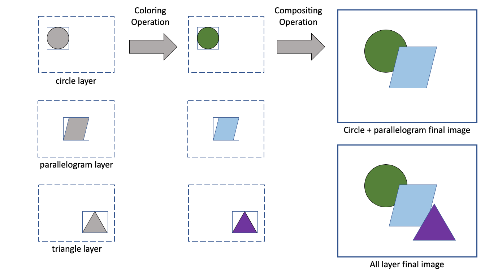

# Composable Image Set format specification

|    |    |
|----|----|
| Date    | 10 Dec 2019 |
| Version | 1.0 |
| Type    | COMPOSABLE_IMAGE_SET |
| Extension | `.cis` |
| Authors | David H. Rogers, John Patchet, Ethan Stam, Dave DeMarle, Sebastian Jourdain, Jonas Lucasczyk |

Cinema creates image-based data that is useful within Cinema but also to a wider set of applications. The format is discussed in <sup>[1]</sup>. The purpose of this specification is to:

1. Completely describe this data type, 
2. Standardize its storage, and 
3. Enable its use by any **producer** or **consumer**. 

# Cinema's compositable images

Cinema is a way to create, manage and view elements from analysis workflows. One element that can be created is an 'explorable image', which the user can interacti with. In practice, this is achieved by logically grouping a set of images together, with layers that can be turned on and off, and sliders that can control things like viewing angle, time, and other parameters. This provides a more interactive image for an end user of a Cinema workflow than a single image that contained no layers. More detailed explanation of these interactive images created can be found in <sup>[1]</sup>, and online examples are [here](https://www.cinemaviewer.org).

A Cinema image is the result of compositing a set of layers together into a final image. A set of layers is chosen, then they are colored, then composited into a final image. The results of the coloring and compositing steps are dependent upon the information contained in the `.cis` file, and the capabilities of the consumer.

<table>
<tr>
<td></img></td>
<tr>
<td>Diagram of layers and possible composited images. Layers can be combined together in many ways. This can be done interactively, giving the user the ability to turn layers on and off.</td>
</tr>
</table>

This specification allows the **producer** of the image to encode a range of information, though there are no constraints on what a **consumer** of the image must do with it. The range of information goes from:

1. Minimal information. This is the minimal information needed to construct an image. All consumers of the images are expected to behave reasonably when minimal information is provided. 
2. Maximum information. This allows a consumer to (optionally) display the finished image in the exact state that the producer expects it to be in. This allows a direct comparison between the producer's image and the consumer's.

## Overview

A **composable image set** is a collection of one or more `images`. `Images` are sets of one or more `layers`. `Layers` are composed of one or more `channels`. `Channels` are composed of `values`.

An **image** is a logical collection of data, formatted to be rendered into an `MxN` array of values intended to be transformed into a color image for display, printing, or in-memory computation. How the pixels are transformed and displayed is up to the consumer of this data, though the producer can provide information about expected results and constraints on this process. The image:

1. Has a know origin, which is one of four values: UL, UR, LL, LR. (upper left, upper right, lower left, lower right)
2. Has a specific 2D integer size (`MxN`)
3. Has one or more `layers`.

A **layer** is a collection of values that comprise an element of an image. A layer:

1. Is of known 2D integer size, less than or equal to the size of the `image`.
2. Has an offset from the `image` origin. The offset values must be integers on the ranges `[0,M]` and `[0,N]`.
3. Shall contain one or more channels. 

A **channel** is a set of values. A channel:

1. Is the size of the layer that contains it
2. Can be of any valid type
3. May be one of a set of **reserved names**. These are:
    - **depth** A channel containing per-pixel depth information. Each value is on the range [0.0, 1.0], which is [top, bottom].
    - **lighting** A channel containing lighting information. The information can be a single value, or a set of values.

# Storage

A `composable image set` may be stored in any of several formats.

## HDF5 storage

The `composable image set` can be stored a single [HDF5](https://en.wikipedia.org/wiki/Hierarchical_Data_Format) file. We note the [existing specification](https://support.hdfgroup.org/HDF5/doc/ADGuide/ImageSpec.html) for images to be stored in HDF5 format. Where possible, this specification adopts conventions from that specification. 

If it is stored in HDF5 format, it shall have the following structure. **NOTE:** Where they do not clash with the specification, additional attributes, groups and datasets may be added by other applications or extensions to this specification, but they are ignored by this specification.

```
/
    class   (attribute, required) COMPOSABLE_IMAGE_SET 
    type    (attribute, optional) FLOAT_IMAGE 
    dims    (attribute, required) [int, int]
            This is the absolute size of the completed image
    flags   (attribute, optional)
            A list of flags, providing additional information about this data
            - IMAGES_INDEPENDENT images DO NOT have the same set of layers and channels. 
                                 Default, if this flag is not included, is that all images 
                                 have the same layers, and all layers have the same channels.
    origin  (attribute, optional) [UL, UR, LL, LR]
            The 0,0 point for the image. Default value is UL
    version (attribute, required) string
            The version of this specification that the data conforms with
    parametertable/ (group, optional)
                    A table encoding paramter/image/layer relationships for this file
        colnames (attribute, required, comma separated string of all column names)
        num_cols (attribute, required, number of columns (int) )
        num_rows (attribute, required, number of rows (int) )
        columns/ (group, required)
            NOTE: no non-column groups allowed below this level; groups assumed to be columns 
            <int> (dataset of ascii encoded string values, one for each colname.
                  The name of the dataset is a zero-based index that maps to the colnames
                  data above. The values in this dataset can include null strings and the 
                  value "NaN" for NaN as needed)
    variables/ (group, optional)
               Information about the variables encoded in image layers
        NOTE: no non-variable groups allowed below this level; groups assumed to be variables 
        <name>/ (group, at least one required if this group is present)
            type (attribute, required)
            min (attribute, required)
            max (attribute, required)
    colormaps/ (group, optional)
        <name>/ (group, at least one required)
        	space (attribute, required) RGB
            colormap (dataset, required) array of 5D points [x, o, r, g, b]
    image/ (group, required)
        NOTE: no non-image groups allowed below this level; groups assumed to be images 
        <name>/ (one or more named groups, each of which is an image) (required)
            layer/ (group, required)
                NOTE: no non-layer groups allowed below this level; groups assumed to be layers 
                <name>/ (required. one or more named groups, each of which is a layer)
                    offset (attribute, optional) [int, int]
                           Offset of the layer's channels from "/origin". If not included, default
                           value is [0, 0], or no offset
                    dims   (attribute, optional) [int, int]
                           Dimensions of the layer. If not present, assumed to be "/dims"
                    channel/ (group, required)
                        NOTE: no non-channel groups allowed below this level; groups assumed to be channels 
                        depth/  (dataset, optional)
                            type (attribute) (optional) [valid type string]
                                 If not present, values are assumed to be float
                        lighting/ (dataset, optional)
                            type (attribute, optional) [valid type string]
                                 If not present, values are assumed to be float
                        <name>/ (one or more named datasets, required)
                            type (attribute, optional) [valid type string]
                                 If not present, values are assumed to be float
                            variable (attribute, optional)
                                 The variable that this channel references
```

## Example

Example python code included in this directory writes and reads a simple `composable image set` in HDF5 format.

1. run `./test` to create example file(s)
    - `composable.cis` contains several images with several layers that can be composed together, and recolored by several variables.  
2. run `h5dump composable.cis` to inspect the contents of the results. `h5dump` is a tool supported by the HDF5 project - you have to download and install those yourself.

Requirements:

1. `h5py` module
2. HDF5-supported tools (optional)

## Cinema Database Reference Example

The `.cis` format is a way of encoding specific types of information. It is up to a **producer** and **consumer** of the data to determine the semantic meaning of the encoded data.

Providing semantic meaning in a Cinema database entails providing metadata about the image/layer/channel components, and referencing a path in the `.cis` file. This is exactly analogous to providing a path to disk, except that the `FILE` that the path maps to is a `.cis` file. 

[This proposal](composable.md) shows how this data should be encoded in a Cinema database.


## Open areas 

One question is how to represent to a consumer enough of a state so that the image can be reconstructed to an expected result. The specification and storage models should include the following information, so that the producer and consumer can perform an apples-to-apples comparison of the images:

1. Default State. This should include current image, layer states (on or off), global variable ranges and default color maps.
2. Color maps


## References

1. James Ahrens, Sebastien Jourdain, Patrick O'Leary, John Patchett, David H. Rogers, and Mark Petersen. An image-based approach to extreme scale in situ visualization and analysis. In Proceedings of the International Conference for High Performance Computing, Networking, Storage and Analysis (SC '14). IEEE Press, Piscataway, NJ, USA, 424-434, 2014.
