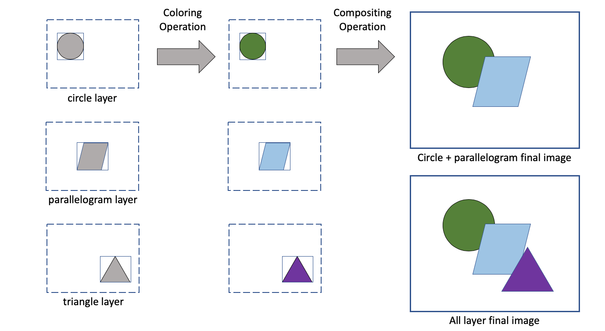

# Composable Image Set format specification

|    |    |
|----|----|
| Date    | 10 Dec 2019 |
| Version | 1.0 |
| Type    | COMPOSABLE_IMAGE_SET |
| Extension | `.cis` |
| Authors | David H. Rogers, John Patchet, Ethan Stam, Dave DeMarle, Sebastian Jourdain, Jonas Lucasczyk |

## Status of this document

This is a draft specification for the `.cis` format, and is under review by the Cinema team and collaborators.

## Introduction

Cinema is a way to create, manage and view elements from analysis workflows. One element that can be created is an explorable image, which the user can interact with. In practice, interactivity is achieved through the `.cis` data specification and a **viewer** which provides controls for the elements of the `.cis` data. The viewer can implement controls that allow elements to be turned on and off,and recolored, as well as controls for parameters such as viewing angle, time, and others. More detailed explanation of these interactive images created can be found in [1], and online examples are [here](https://www.cinemaviewer.org).

This specification allows the **producer** of the image to encode a range of information, though there are no constraints on what a **consumer** of the image must do with it. The range of information goes from:

1. Minimal information. This is the minimal information needed to construct an image. All consumers of the images are expected to behave reasonably when minimal information is provided. 
2. Maximum information. This allows a consumer to (optionally) display the finished image in the exact state that the producer expects it to be in. This allows a direct comparison between the producer's image and the consumer's.

## The `.cis` definition 

### Overview
A `.cis` file is a logical collection of related images.

A single `.cis` image is the result of coloring and compositing a set of elements together. The results of the coloring and compositing steps are dependent upon the information contained in the `.cis` file, choices by the user, and the capabilities of the **consumer** application.

<table>
<tr>
<td></img></td>
<tr>
<td>Diagram of layers and possible composited images. Layers can be combined together in many ways, depending upon the information that is included in the .cis file, as well as the capabilities of the consumer of the data.</td>
</tr>
</table>

### Definitions

A **composable image set** is a collection of one or more `images` and optional associated metadata. `Images` are sets of one or more `layers`. `Layers` are composed of one or more `channels`. `Channels` are composed of `values`. The **composable image set**:

1. Contains one or more image.
    - The images need not have the same internal structure. In particular, the images may have different `layers` or `channels`.
1. May contain additional information not included in this specification. That data may be ignored by compliant **consumers** of this data.

An **image** is a logical collection of data, formatted to be rendered into an `MxN` array of values intended to be transformed into a color image for display, printing, or in-memory computation. How the pixels are transformed and displayed is up to the consumer of this data, though the producer can provide information about expected results and constraints on this process. The image:

1. Has a unique name relative to the **image set**. A name is any string of ASCII characters not containing a slash `'` or a dot `.`.
2. Has a know origin, which is one of four values: UL, UR, LL, LR. (upper left, upper right, lower left, lower right)
3. Has a specific 2D integer size (`MxN`)
4. Contains one or more `layers`.

A **layer** is a collection of values that comprise an element of an image. A layer:

1. Has a unique name, relative to the `image` it is part of. A name is any string of ASCII characters not containing a slash `/` or a dot `.`.
1. Is of known 2D integer size (`WxH`), less than or equal to the size of the `image`.
2. Has an offset from the `image` origin. The offset values must be integers on the ranges `[0,M]` and `[0,N]`.
    - The `offset` and the `size` of a layer must combine such that the extents of the layer lie within the boundary of the `image`.
4. Contains one or more `channels`.

A **channel** is a set of values. A channel:

1. Has a unique name, relative to the `layer` it is part of. A name is any string of ASCII characters not containing a slash `/` or a dot `.`.
1. Is the size of the layer that contains it (`WxH`)
2. Can be of any valid type. Default is an `WxH` array of **float**, unless otherwise specified.
3. May be one of a set of **reserved names**. These are:
    - **depth** A channel containing per-pixel depth information. Each value is on the range [0.0, 1.0], which is [top, bottom].
    - **lighting** A channel containing lighting information. The information can be a single value, or a set of values.
1. May reference a **variable** which can be used by a consumer to psuedocolor it.
2. May reference a colormapt which can be used by a consumer to psuedocolor it.

A **variable** is a definition of a value. A variable:

1. Has a unique name, type and range (min, max)

A **colormap** is data used to map a value to a color. A colormap:

1. Has a unique name.
2. The definition of the colormap:
    - may be included in the `.cis` file, or
    - may be and external reference (URL) to a colormap definition

# Storage

A `composable image set` may be stored in any of several formats.

## File-based storage 

The `composable image set` can be stored as files on disk:

- [v1.0 file storage specification](storage_file.md) 

## HDF5 storage

The `composable image set` can be stored a single [HDF5](https://en.wikipedia.org/wiki/Hierarchical_Data_Format) file. 

- [v1.0 storage specification](storage_hdf5.md) 

